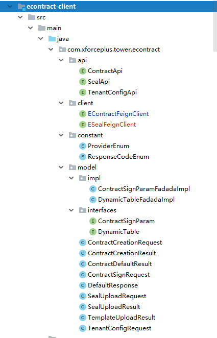

## 电子合同服务
### 1.Jar包引入
    <dependency>
    <groupId>com.xforceplus</groupId>
    <artifactId>econtract-client</artifactId>
    <version>1.0-SNAPSHOT</version>
    </dependency>
联调版本请使用1.0-SNAPSHOT，发布版本请使用1.0.0
客户端包含了接口路径、响应状态码、请求参数模型、响应参数模型等，详见下图。

--
### 2.创建客户端（以FeignClient为例）
    import com.xforceplus.tower.econtract.api.ContractApi;
    import com.xforceplus.tower.econtract.api.SealApi;
    
    // 外网访问
    // @FeignClient(name = "econtract-service", url = "http://econtract-fat.phoenix-t.xforceplus.com")
    // 内网访问
    @FeignClient(name = "econtract-service:8080")
    public interface EContractClient extends ContractApi{}
    
    // 外网访问
    // @FeignClient(name = "econtract-service", url = "http://econtract-fat.phoenix-t.xforceplus.com")
    // 内网访问
    @FeignClient(name = "econtract-service:8080")
    public interface ESealClient extends SealApi{}
    
 或者 直接使用依赖中的EContractFeignClient和ESealFeignClient，同时请在您的服务中配置变量econtract.service.url

### 3.接口对接开发
#### 上传签章文字或图片
    Long appId = 1L;
    Long tenantId = 1L;
    Long companyId = 1L;
    SealUploadRequest sealUploadRequest = new SealUploadRequest();
    sealUploadRequest.setSealBody("XXXX投资公司");
    // sealUploadRequest.setSealImageBase64("XXCFSFSDFSDFSDFSDF");
    DefaultResponse<SealUploadResult> defaultResponse = sealClient.uploadSeal(tenantId,appId,companyId, sealUploadRequest);

#### 响应参数解析样例
    if (defaultResponse.isSuccess()){
        SealUploadResult sealUploadResult = defaultResponse.getResult();
        String sealImageBase64 = sealUploadResult.getSealImageBase64();
    }
    
#### 创建合同
##### 请求参数构造样例  
         Long appId = 1L;
         Long tenantId = 1L;
         Long companyId = 1L;
         String templateId = "abc";
         ContractCreationRequest contractCreationRequest = new ContractCreationRequest();
         contractCreationRequest.setContractTitle("XXX合同");
         contractCreationRequest.setTemplateId(templateId);
         contractCreationRequest.setFontSize("10");
         contractCreationRequest.setFontType("0");
         
         Map<String, Object> parameterMap = new HashMap<>();
         parameterMap.put("姓名","张三");
         contractCreationRequest.setParameterMap(parameterMap);
         
         DynamicTableFadadaImpl dynamicTable = new DynamicTableFadadaImpl();
         dynamicTable.setBorderFlag(true);
         dynamicTable.setData(new String[][]{{"123","123"}});
         List<String> tables = new ArrayList<>();
         tables.add(JSON.toJSONString(dynamicTable));
         contractCreationRequest.setDynamicTables(tables);
         
         DefaultResponse<ContractCreationResult> defaultResponse = contractClient.createContract(tenantId,appId,companyId,contractCreationRequest);
##### 响应参数解析样例
    if (defaultResponse.isSuccess()) {
        TemplateUploadResult templateUploadResult = defaultResponse.getResult();
        String templateId = templateUploadResult.getTemplateId();
    }
    
#### 上传合同模板
##### 请求参数构造样例
    Long appId = 1L;
    Long tenantId = 1L;
    Long companyId = 1L;
    MultipartFile multipartFile = null;
    DefaultResponse<TemplateUploadResult> defaultResponse = contractClient.uploadTemplate(tenantId, appId, companyId, multipartFile);
##### 响应参数解析样例
    if (defaultResponse.isSuccess()) {
        TemplateUploadResult templateUploadResult = defaultResponse.getResult();
        String templateId = templateUploadResult.getTemplateId();
    }

#### 获取合同
##### 请求参数构造样例
    Long appId = 1L;
    Long tenantId = 1L;
    Long companyId = 1L;
    String contractId = "sdfsfdsfds";
    Boolean download = true;
    DefaultResponse<String> defaultResponse = contractClient.obtainContract(tenantId, contractId, appId, companyId, download);
##### 响应参数解析样例
    if (defaultResponse.isSuccess()) {
        String url = defaultResponse.getResult();
    }

#### 签署合同
##### 请求参数构造样例
    Long appId = 1L;
    Long tenantId = 1L;
    Long companyId = 1L;
    String contractId = "sdfsfdsfds";
    Boolean auto = true;
    ContractSignRequest contractSignRequest = new ContractSignRequest();
    contractSignRequest.setContractTitle("XXXXX投资合同");
    contractSignRequest.setSealId("fsfeewrfwe");
    contractSignRequest.setTransactionId("1234567");
    ContractSignParamFadadaImpl parameters = new ContractSignParamFadadaImpl();
    parameters.setSignKeyword("签章");
    parameters.setKeywordStrategy("123");
    Map<String, Object> parameterMap = BeanUtils.describe(parameters);;
    contractSignRequest.setParameters(parameterMap);
    DefaultResponse<ContractDefaultResult> defaultResponse = contractClient.signContract(tenantId, contractId, appId, companyId, auto, contractSignRequest);
##### 响应参数解析样例
    if (defaultResponse.isSuccess()) {
        ContractDefaultResult contractDefaultResult = defaultResponse.getResult();
        String downloadUrl = contractDefaultResult.getDonwloadUrl();
        String viewUrl = contractDefaultResult.getViewUrl();
    }

#### 返回码清单
|  code   | message | 描述 |
|  :----  | :----  | :--- |
| ELCCZZ0500  | 系统处理异常 | 往往会附带更多信息，重试多次后无法解决请联系管理员    |
| ELCCZZ0200 | 请求成功 | 附加返回参数请参看result内容 |
| ELCCZZ0400 | 请求参数错误 | 请求参数校验失败，请按提示修改后重新提交 |
| ELCCZZ1001 | 第三方调用超时 | 第三方供应商服务调用超时，重试多次后无法解决请联系管理员 |
| ELCCZZ1002 | 第三方调用异常 | 第三方供应商服务系统异常，重试多次后无法解决请联系管理员 |